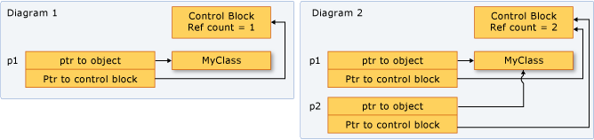

# 智能指针的创建和使用


## unique_ptr

**`unique_ptr`** 指针是不能共享的，它不能被拷贝到另一个 **`unique_ptr`**，或通过值传递给函数，或任何 C++ 标准算法中需要拷贝操作的地方。一个 **`unique_ptr`** 只能将内存资源的所有权转移到另一个 **`unique_ptr`**，并且其不再享有资源的所有权。建议严格控制对象的 **owner** ，最好只有一个，以避免增加程序的逻辑复杂性。因此，当你需要一个用于 POCO 的智能指针时，使用 **`unique_ptr`**， 并且在创建 **`unique_ptr`** 的时候使用 **`make_unique`** 函数。

下图演示了 `unique_ptr` 实例之间的 **owner** 转移。


`unique_ptr` 定义在 C++ 标准库的 `<memory>` 头文件中，它和原始指针的效率几乎一样，能够用于 C++ 标准库的容器。包含 `unique_ptr` 实例的 C++ 标准库容器依然是高效的，因为 `unique_ptr` 的移动构造函数避免了拷贝操作。

### 示例 1

以下示例演示了如何创建 `unique_ptr` 实例，并且在函数之间传递。

```cpp
unique_ptr<Song> SongFactory(const std::wstring& artist, const std::wstring& title)
{
    // Implicit move operation into the variable that stores the result.
    return make_unique<Song>(artist, title);
}

void MakeSongs()
{
    // Create a new unique_ptr with a new object.
    auto song = make_unique<Song>(L"Mr. Children", L"Namonaki Uta");

    // Use the unique_ptr.
    vector<wstring> titles = { song->title };

    // Move raw pointer from one unique_ptr to another.
    unique_ptr<Song> song2 = std::move(song);

    // Obtain unique_ptr from function that returns by value.
    auto song3 = SongFactory(L"Michael Jackson", L"Beat It");
}
```
这个示例演示了 `unique_ptr` 的基本特点：它能够被移动，但是不能被拷贝。“移动” 操作将 owner 转移到了新的 `unique_ptr` 并且重置了旧的 `unique_ptr`。

### 示例 2

以下示例演示了如何创建 `unique_ptr` 实例，并且在容器中使用。

```cpp
void SongVector()
{
    vector<unique_ptr<Song>> songs;

    // Create a few new unique_ptr<Song> instances
    // and add them to vector using implicit move semantics.
    songs.push_back(make_unique<Song>(L"B'z", L"Juice"));
    songs.push_back(make_unique<Song>(L"Namie Amuro", L"Funky Town"));
    songs.push_back(make_unique<Song>(L"Kome Kome Club", L"Kimi ga Iru Dake de"));
    songs.push_back(make_unique<Song>(L"Ayumi Hamasaki", L"Poker Face"));

    // Pass by const reference when possible to avoid copying.
    for (const auto& song : songs)
    {
        wcout << L"Artist: " << song->artist << L"   Title: " << song->title << endl; 
    }    
}
```
在 for 循环中，注意 `unique_ptr` 是通过引用传递的。如果你试图通过值传递，编译器会返回错误，因为 `unique_ptr` 的拷贝构造函数已经被 `delete` 了。

### 示例 3

以下示例演示了如何初始化作为类成员的 `unique_ptr`。

```cpp
class MyClass
{
private:
    // MyClass owns the unique_ptr.
    unique_ptr<ClassFactory> factory;
public:

    // Initialize by using make_unique with ClassFactory default constructor.
    MyClass() : factory ( make_unique<ClassFactory>())
    {
    }

    void MakeClass()
    {
        factory->DoSomething();
    }
};
```
### Example 4

你可以使用 `make_unique` 来创建一个指向 array 的 `unique_ptr`，但是不能用 `make_unique` 来初始化 array 的元素。

```cpp
// Create a unique_ptr to an array of 5 integers.
auto p = make_unique<int[]>(5);

// Initialize the array.
for (int i = 0; i < 5; ++i)
{
    p[i] = i;
    wcout << p[i] << endl;
}
```

## shared_ptr

`shared_ptr` 类型是 C++ 标准库中的智能指针，其设计的使用场景为：内存中对象的生命周期存在由多个 owner 来管理的情况。

当 `shared_ptr` 初始化后，它可以被拷贝，以值传递的方式传递给函数，赋值给其他的 `shared_ptr` 实例。

所有的实例都指向同一个对象，并共享同一个“控制块”，当一个指向相同对象的 `shared_ptr` 被新建，或者销毁，该控制块用于增加和减少引用计数。

当引用计数为零时，控制块将删除对象资源及其本身。


下图演示了几个 `shared_ptr` 实例指向同一个内存地址。


### 初始化示例

以下所有示例假设你包含了所有需要的头文件和如下的类型声明：

```cpp
// shared_ptr-examples.cpp
// The following examples assume these declarations:
#include <algorithm>
#include <iostream>
#include <memory>
#include <string>
#include <vector>

struct MediaAsset
{
    virtual ~MediaAsset() = default; // make it polymorphic
};

struct Song : public MediaAsset
{
    std::wstring artist;
    std::wstring title;
    Song(const std::wstring& artist_, const std::wstring& title_) :
        artist{ artist_ }, title{ title_ } {}
};

struct Photo : public MediaAsset
{
    std::wstring date;
    std::wstring location;
    std::wstring subject;
    Photo(
        const std::wstring& date_,
        const std::wstring& location_,
        const std::wstring& subject_) :
        date{ date_ }, location{ location_ }, subject{ subject_ } {}
};

using namespace std;

int main()
{
    // The examples go here, in order:
    // Example 1
    // Example 2
    // Example 3
    // Example 4
    // Example 6
}
```

### 示例 1

如果内存资源是首次被创建，尽可能地使用 `make_shared` 来创建 `shared_ptr`。`make_shared` 是异常安全的(exception-safe)。它使用单次调用来创建对象资源和控制块的内存，从而降低了构建的开销。

如果你不使用 `make_shared`，那么在你传递对象给 `shared_ptr` 之前，你必须显示使用 **`new`** 表达式来创建对象，以下示例演示了各种方式用一个新对象来声明和初始化一个 `shared_ptr`。

```cpp
// Use make_shared function when possible.
auto sp1 = make_shared<Song>(L"The Beatles", L"Im Happy Just to Dance With You");

// Ok, but slightly less efficient. 
// Note: Using new expression as constructor argument
// creates no named variable for other code to access.
shared_ptr<Song> sp2(new Song(L"Lady Gaga", L"Just Dance"));

// When initialization must be separate from declaration, e.g. class members, 
// initialize with nullptr to make your programming intent explicit.
shared_ptr<Song> sp5(nullptr);
//Equivalent to: shared_ptr<Song> sp5;
//...
sp5 = make_shared<Song>(L"Elton John", L"I'm Still Standing");
```

### 示例 2

以下示例演示了如何用已经被其他 `shared_ptr` 控制的对象来声明和初始化新的 `shared_ptr` 实例。
假设 `sp2` 是一个初始化了的 `shared_ptr`。

```cpp
//Initialize with copy constructor. Increments ref count.
auto sp3(sp2);

//Initialize via assignment. Increments ref count.
auto sp4 = sp2;

//Initialize with nullptr. sp7 is empty.
shared_ptr<Song> sp7(nullptr);

// Initialize with another shared_ptr. sp1 and sp2
// swap pointers as well as ref counts.
sp1.swap(sp2);
```

### 示例 3

在 C++ 标准库容器中使用算法拷贝元素时，`shared_ptr` 同样有用。你可以用 `shared_ptr` 来封装元素，然后将其拷贝到其他的容器。以下示例演示了如何在 vector 中对 `shared_ptr` 实例使用 `remove_copy_if` 算法。

```cpp
vector<shared_ptr<Song>> v {
  make_shared<Song>(L"Bob Dylan", L"The Times They Are A Changing"),
  make_shared<Song>(L"Aretha Franklin", L"Bridge Over Troubled Water"),
  make_shared<Song>(L"Thalía", L"Entre El Mar y Una Estrella")
};

vector<shared_ptr<Song>> v2;
remove_copy_if(v.begin(), v.end(), back_inserter(v2), [] (shared_ptr<Song> s) 
{
    return s->artist.compare(L"Bob Dylan") == 0;
});

for (const auto& s : v2)
{
    wcout << s->artist << L":" << s->title << endl;
}
```


### 示例 4

你可以使用 `dynamic_pointer_cast`, `static_pointer_cast`, 和 `const_pointer_cast` 来转换 `shared_ptr`。这些函数类似 **`dynamic_cast`**, **`static_cast`**, 和 **`const_cast`** 操作符。

```cpp
vector<shared_ptr<MediaAsset>> assets {
  make_shared<Song>(L"Himesh Reshammiya", L"Tera Surroor"),
  make_shared<Song>(L"Penaz Masani", L"Tu Dil De De"),
  make_shared<Photo>(L"2011-04-06", L"Redmond, WA", L"Soccer field at Microsoft.")
};

vector<shared_ptr<MediaAsset>> photos;

copy_if(assets.begin(), assets.end(), back_inserter(photos), [] (shared_ptr<MediaAsset> p) -> bool
{
    // Use dynamic_pointer_cast to test whether
    // element is a shared_ptr<Photo>.
    shared_ptr<Photo> temp = dynamic_pointer_cast<Photo>(p);
    return temp.get() != nullptr;
});

for (const auto&  p : photos)
{
    // We know that the photos vector contains only 
    // shared_ptr<Photo> objects, so use static_cast.
    wcout << "Photo location: " << (static_pointer_cast<Photo>(p))->location << endl;
}
```

### 示例 5
`shared_ptr` 可以用如下方式传递给函数：

- 通过**值传递**的方式。这会调用拷贝构造函数，增加引用计数，被调用函数成为 owner 之一。该操作有些许额外的开销，取决于有多少 `shared_ptr` 对象被传递。当上下文逻辑需要被调函数成为 owner 时使用这种方式。
- 通过**引用**或者**静态引用**的方式。引用计数不会增加，被调函数能够访问指针只要调用方没有超出作用域。或者，被调函数也可以创建一个该引用的 `shared_ptr`，而成为 owner。当调用者不清楚被调函数内部或者为了避免拷贝操作时，使用这种方式。
- 通过传递原始指针或者原始对象的引用。这使得被调函数可以使用对象，但是不能够与他人共享所有权或者扩展其生命周期。如果被调函数通过原始指针创建了一个新的 `shared_ptr`，新的 `shared_ptr` 和 原有的 `shared_ptr` 是独立的，并且不会控制底层资源。当上下文环境明确需要调用方保留 `shared_ptr` 生命周期的所有权时使用这种方式。
- 当你在判断如何传递 `shared_ptr` 时，请确定被调函数是否要共享底层资源的所有权。一个 owner 是一个对象或者函数，只要它需要，它能够维持底层资源的有效性。如果调用方必须保证被调函数能够扩展指针的的生命周期(超出被调函数的生命周期)，那么请使用第一种方式。如果调用方不在意被调函数是否扩展资源的生命周期，那么请通过引用传递的方式让被调函数来决定是否拷贝它。
- If you have to give a helper function access to the underlying pointer, and you know that the helper function will just use the pointer and return before the calling function returns, then that function doesn't have to share ownership of the underlying pointer. It just has to access the pointer within the lifetime of the caller's `shared_ptr`. In this case, it's safe to pass the `shared_ptr` by reference, or pass the raw pointer or a reference to the underlying object. Passing this way provides a small performance benefit, and may also help you express your programming intent.
- Sometimes, for example in a `std::vector<shared_ptr<T>>`, you may have to pass each `shared_ptr` to a lambda expression body or named function object. If the lambda or function doesn't store the pointer, then pass the `shared_ptr` by reference to avoid invoking the copy constructor for each element.

### 示例 6

以下示例演示了 `shared_ptr` 如何重载了各种比较运算符来比较 `shared_ptr` 指针。

```cpp
// Initialize two separate raw pointers.
// Note that they contain the same values.
auto song1 = new Song(L"Village People", L"YMCA");
auto song2 = new Song(L"Village People", L"YMCA");

// Create two unrelated shared_ptrs.
shared_ptr<Song> p1(song1);    
shared_ptr<Song> p2(song2);

// Unrelated shared_ptrs are never equal.
wcout << "p1 < p2 = " << std::boolalpha << (p1 < p2) << endl;
wcout << "p1 == p2 = " << std::boolalpha <<(p1 == p2) << endl;

// Related shared_ptr instances are always equal.
shared_ptr<Song> p3(p2);
wcout << "p3 == p2 = " << std::boolalpha << (p3 == p2) << endl;
```

## weak_ptr

Sometimes an object must store a way to access the underlying object of a [shared_ptr](../standard-library/shared-ptr-class.md) without causing the reference count to be incremented. Typically, this situation occurs when you have cyclic references between `shared_ptr` instances.

The best design is to avoid shared ownership of pointers whenever you can. However, if you must have shared ownership of `shared_ptr` instances, avoid cyclic references between them. When cyclic references are unavoidable, or even preferable for some reason, use [weak_ptr](../standard-library/weak-ptr-class.md) to give one or more of the owners a weak reference to another `shared_ptr`. By using a `weak_ptr`, you can create a `shared_ptr` that joins to an existing set of related instances, but only if the underlying memory resource is still valid. A `weak_ptr` itself does not participate in the reference counting, and therefore, it cannot prevent the reference count from going to zero. However, you can use a `weak_ptr` to try to obtain a new copy of the `shared_ptr` with which it was initialized. If the memory has already been deleted, the `weak_ptr`'s bool operator returns **`false`**. If the memory is still valid, the new shared pointer increments the reference count and guarantees that the memory will be valid as long as the `shared_ptr` variable stays in scope.

### Example

The following code example shows a case where `weak_ptr` is used to ensure proper deletion of objects that have circular dependencies. As you examine the example, assume that it was created only after alternative solutions were considered. The `Controller` objects represent some aspect of a machine process, and they operate independently. Each controller must be able to query the status of the other controllers at any time, and each one contains a private `vector<weak_ptr<Controller>>` for this purpose. Each vector contains a circular reference, and therefore, `weak_ptr` instances are used instead of `shared_ptr`.

```cpp
#include <iostream>
#include <memory>
#include <string>
#include <vector>
#include <algorithm>

using namespace std;

class Controller
{
public:
   int Num;
   wstring Status;
   vector<weak_ptr<Controller>> others;
   explicit Controller(int i) : Num(i), Status(L"On")
   {
      wcout << L"Creating Controller" << Num << endl;
   }

   ~Controller()
   {
      wcout << L"Destroying Controller" << Num << endl;
   }

   // Demonstrates how to test whether the
   // pointed-to memory still exists or not.
   void CheckStatuses() const
   {
      for_each(others.begin(), others.end(), [](weak_ptr<Controller> wp) {
         auto p = wp.lock();
         if (p)
         {
            wcout << L"Status of " << p->Num << " = " << p->Status << endl;
         }
         else
         {
            wcout << L"Null object" << endl;
         }
      });
   }
};

void RunTest()
{
   vector<shared_ptr<Controller>> v{
       make_shared<Controller>(0),
       make_shared<Controller>(1),
       make_shared<Controller>(2),
       make_shared<Controller>(3),
       make_shared<Controller>(4),
   };

   // Each controller depends on all others not being deleted.
   // Give each controller a pointer to all the others.
   for (int i = 0; i < v.size(); ++i)
   {
      for_each(v.begin(), v.end(), [&v, i](shared_ptr<Controller> p) {
         if (p->Num != i)
         {
            v[i]->others.push_back(weak_ptr<Controller>(p));
            wcout << L"push_back to v[" << i << "]: " << p->Num << endl;
         }
      });
   }

   for_each(v.begin(), v.end(), [](shared_ptr<Controller> &p) {
      wcout << L"use_count = " << p.use_count() << endl;
      p->CheckStatuses();
   });
}

int main()
{
   RunTest();
   wcout << L"Press any key" << endl;
   char ch;
   cin.getline(&ch, 1);
}
```

```Output
Creating Controller0
Creating Controller1
Creating Controller2
Creating Controller3
Creating Controller4
push_back to v[0]: 1
push_back to v[0]: 2
push_back to v[0]: 3
push_back to v[0]: 4
push_back to v[1]: 0
push_back to v[1]: 2
push_back to v[1]: 3
push_back to v[1]: 4
push_back to v[2]: 0
push_back to v[2]: 1
push_back to v[2]: 3
push_back to v[2]: 4
push_back to v[3]: 0
push_back to v[3]: 1
push_back to v[3]: 2
push_back to v[3]: 4
push_back to v[4]: 0
push_back to v[4]: 1
push_back to v[4]: 2
push_back to v[4]: 3
use_count = 1
Status of 1 = On
Status of 2 = On
Status of 3 = On
Status of 4 = On
use_count = 1
Status of 0 = On
Status of 2 = On
Status of 3 = On
Status of 4 = On
use_count = 1
Status of 0 = On
Status of 1 = On
Status of 3 = On
Status of 4 = On
use_count = 1
Status of 0 = On
Status of 1 = On
Status of 2 = On
Status of 4 = On
use_count = 1
Status of 0 = On
Status of 1 = On
Status of 2 = On
Status of 3 = On
Destroying Controller0
Destroying Controller1
Destroying Controller2
Destroying Controller3
Destroying Controller4
Press any key
```

As an experiment, modify the vector `others` to be a `vector<shared_ptr<Controller>>`, and then in the output, notice that no destructors are invoked when `RunTest` returns.
