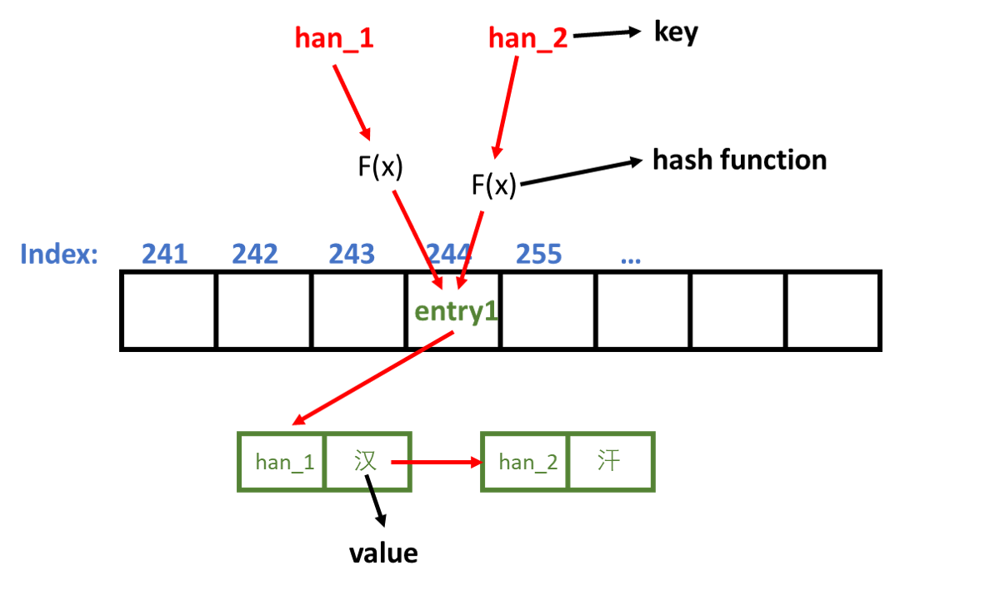

## 要点回顾
> 此部分方便知识点快速回顾，首次阅读请从引言部分开始。

- 哈希表（Hash Table）其实也叫散列表，是一个数据结构。
  
- 哈希表本质上就是一个数组，只不过数组存放的是单一的数据，而哈希表中存放的是键值对（key - value pair）。
  
- key 通过哈希函数（hash function）得到数组的索引，进而存取索引位置的值。
  
- 不同的 key 通过哈希函数可能得到相同的索引值，此时，产生了哈希碰撞。
  
- 通过在数组中插入链表或者二叉树，可以解决哈希碰撞问题。

## 引言

哈希这个词想必大家经常听到，这也说明了它使用的频繁程度，HashMap 和 HashTable 都与哈希这个词有关系。那哈希是什么，要搞清楚它，我们得先来说下哈希表。

## 什么是哈希表？

**哈希表（Hash Table）** 是一种用于存储 **键值对** 的基本数据结构。在 C++ 中，哈希表使用 **哈希函数** 来计算数组的索引，进而存取数组中对应索引位置的值。

百科定义：
> 散列表（Hash table，也叫哈希表），是根据键（Key）而直接访问在内存存储位置的数据结构。也就是说，它通过计算一个关于键值的函数，将所需查询的数据映射到表中一个位置来访问记录，这加快了查找速度。这个映射函数称做散列函数，存放记录的数组称做散列表。

计算索引的过程被称为 **哈希（hash）**。

## 哈希表实现原理

用一个简单的例子来说明哈希表的原理：

**假设**：有一本中文词典，里面包含了所有的汉字，但是这些汉字是按任意顺序随意排版的，那么想要在其中找到某一个汉字，你就需要从头至尾一个一个核查，如果运气差，这个汉字正好在词典的末尾，那你需要遍历整本词典才能找到你要查的汉字。

**优化**：因为汉字和拼音之间存在着一种确定的关系，为了提高查找速度，现在将所有汉字按照拼音（key）进行排序（拼音可以根据首字母，第二个字母依次进一步排序），并且每个拼音都有一个对应页码（index），从该页开始，存放拼音对应的汉字（value）。所以找到拼音，也就能在对应的页码找到对应的汉字。其中，拼音和页码之间，有着某种固定的映射关系，可以通过某种方式计算出来（hash function）。

由此可见，哈希表可以根据一个 key 值来直接访问数据，因此查找速度快。

**但是**，上面的例子，还存在一个问题，放在同一页码（具有相同拼音）的汉字可能不止一个（同音字），这时候通过拼音（key）获取到的汉字（value）应该是哪个呢？这就出现了**碰撞（hash collision）**。

为了解决碰撞，实现哈希表可以有以下两种方式：
- 数组 + 链表
- 数组 + 二叉树

所以，**哈希表本质上就是一个数组**。只不过数组存放的是单一的数据，而哈希表中存放的是键值对。

链表或二叉树是用来解决碰撞的。

下面用图例说明哈希表以及解决哈希碰撞的链表实现：

因为哈希表中 key 必须是唯一的，所以图示给拼音加了后缀 _1 和 _2。key *han_1* 和 *han_2* 通过哈希函数 *F(x)* 计算出来的页码都是 *244*。这时就产生了哈希碰撞。为了解决碰撞问题，新建了一个链表，链表的每个结点都包含了一个键值对，当输入 key *han_2* 时，哈希表在 *244* 位置找到了键值对 *[han_1 - 汉]*，但是通过比对发现找到的键值对的 key 是 *han_1*，不等于 *han_2*，所以继续遍历到链表的下一个结点，下一个结点存放了键值对 *[han_2 - 汗]*，通过比较发现 key 确实是 *han_2*，因此返回了汉字（value）*汗*。

## 引用
https://www.educba.com/c-plus-plus-hash-table/

https://mp.weixin.qq.com/s/AkPIN6Ugno9vkQ2AAmCEAA